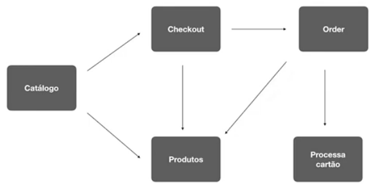

# e-Commerce Microservices

Aplicação desenvolvida durante estudos sobre arquitetura de microsserviços da [Code Education](https://code.education/), utilizando as tecnologias:
- Go
- Docker
- RabbitMQ
- Kubernetes
- Istio / Service Mesh

